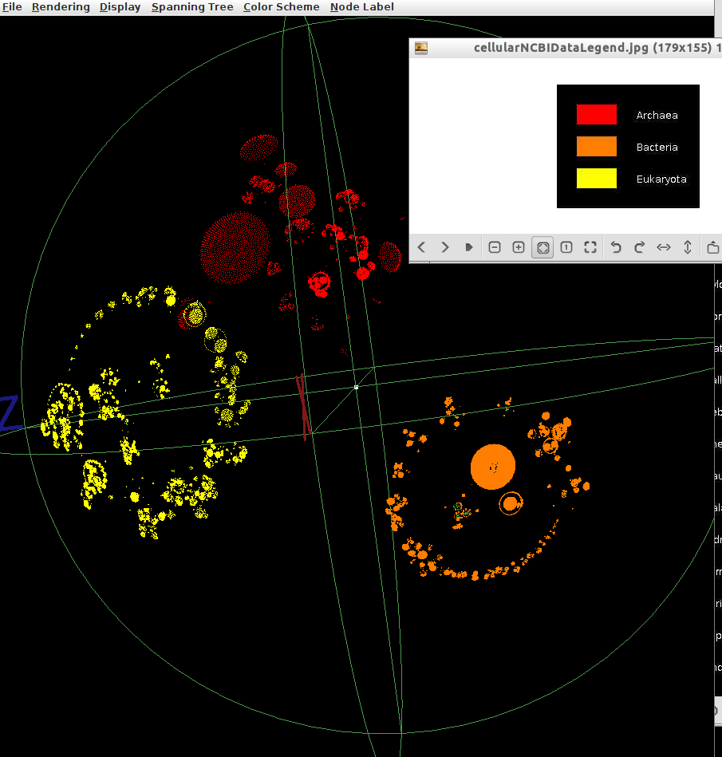
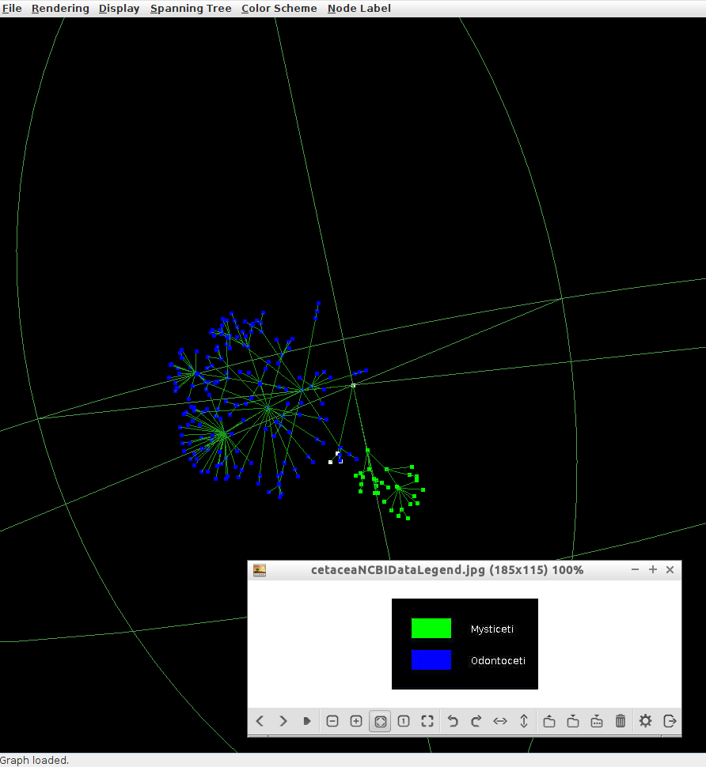
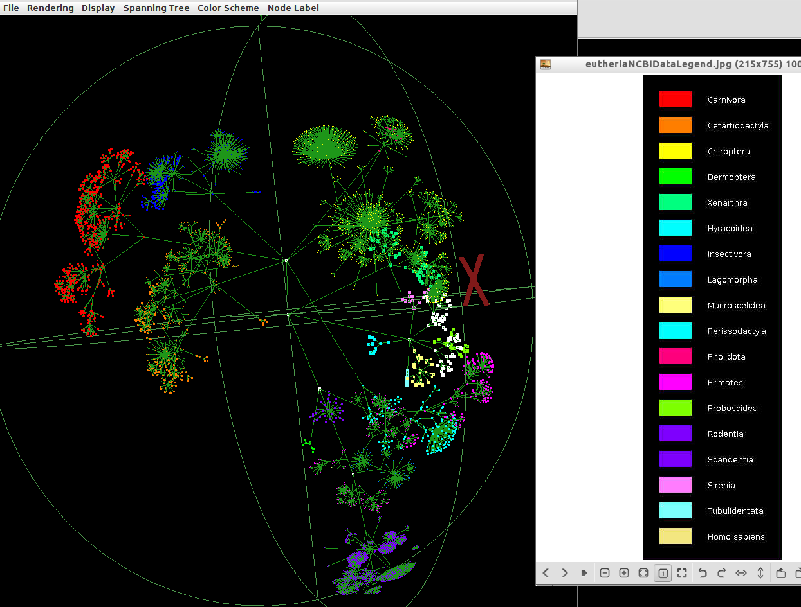
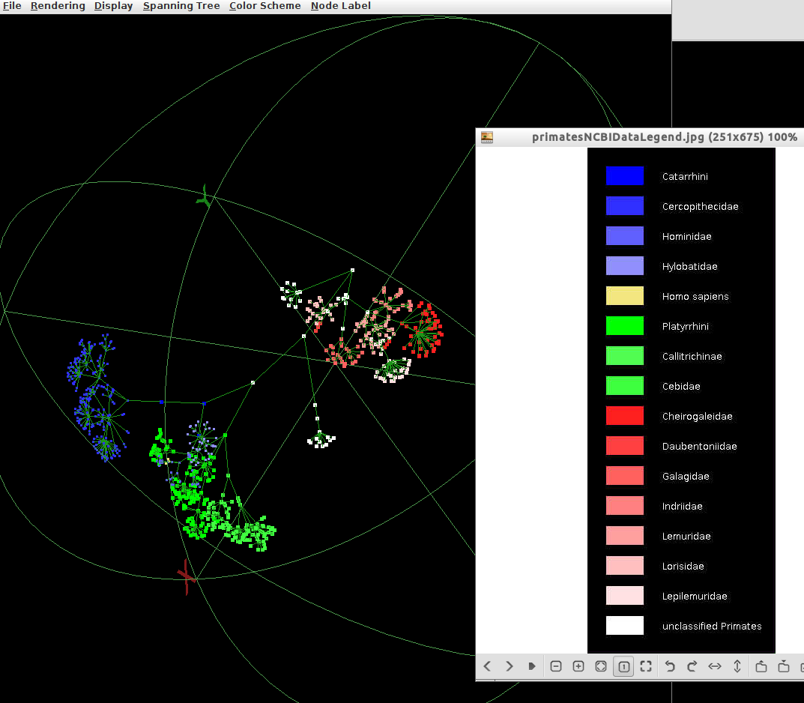

#Phylo3D - 3D Phylogenetic Tree Visualization
Unofficial source imprort of [Phylo3D](http://bmcbioinformatics.biomedcentral.com/articles/10.1186/1471-2105-5-48) written by Tim Hughes.

`master` branch contains compatibility update for JDK 1.6+ and fix for memory leak while processing huge files.

To produce graphs

```
java -Xmx2g -cp src/.:dists/ATVapp.jar phylo3D.datafiles.DataFilesUpdater
```






http://bmcbioinformatics.biomedcentral.com/articles/10.1186/1471-2105-5-48

http://www.caida.org/tools/visualization/walrus/

ftp://ftp.ncbi.nlm.nih.gov/pub/taxonomy/

http://www.ncbi.nlm.nih.gov/taxonomy
